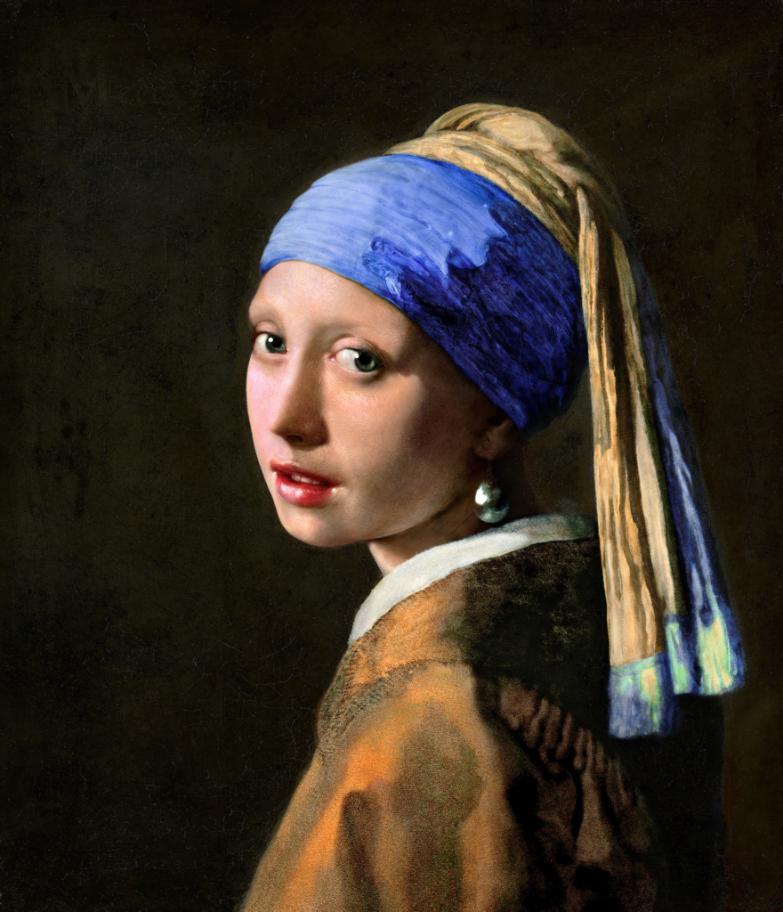
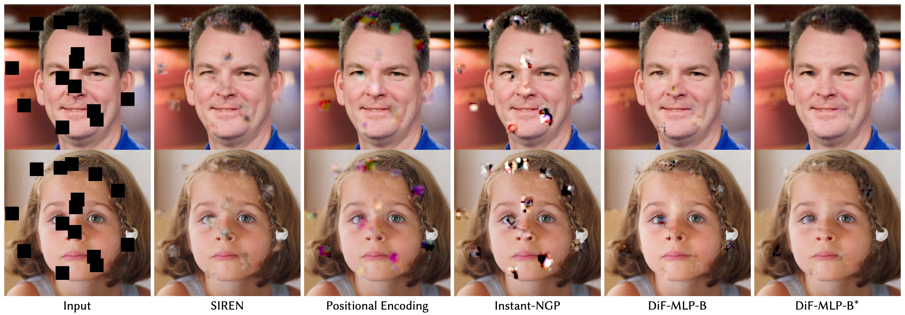

# Factor Fields
## [Project page](https://apchenstu.github.io/FactorFields/) |  [Paper](https://arxiv.org/abs/2302.01226)
This repository contains a pytorch implementation for the paper: [Factor Fields: A Unified Framework for Neural Fields and Beyond](https://arxiv.org/abs/2302.01226) and [Dictionary Fields: Learning a Neural Basis Decomposition](https://arxiv.org/abs/2302.01226). Our work present a novel framework for modeling and representing signals, 
we have also observed that Dictionary Fields offer benefits such as improved **approximation quality**, **compactness**, **faster training speed**, and the ability to **generalize** to unseen images and 3D scenes.<br><br>


## Installation

#### Tested on Ubuntu 20.04 + Pytorch 1.13.0 

Install environment:
```sh
conda create -n FactorFields python=3.9
conda activate FactorFields
conda install -c "nvidia/label/cuda-11.7.1" cuda-toolkit
conda install pytorch==1.13.0 torchvision==0.14.0 torchaudio==0.13.0 pytorch-cuda=11.7 -c pytorch -c nvidia
pip install -r requirements.txt 
```

Optionally install [tiny-cuda-nn](https://github.com/NVlabs/tiny-cuda-nn), only needed if you want to run hash grid based representations.
```sh
conda install -c "nvidia/label/cuda-11.7.1" cuda-toolkit
pip install git+https://github.com/NVlabs/tiny-cuda-nn/#subdirectory=bindings/torch
```


# Quick Start
Please ensure that you download the corresponding dataset and extract its contents into the `data` folder.

## Image
* [Data - Image Set](https://1drv.ms/u/s!Ard0t_p4QWIMiHdstRyBDyH3XOIa?e=VlfZiv)

The training script can be found at `scripts/2D_regression.ipynb`, and the configuration file is located at `configs/image.yaml`.

<p align="left">
  
</p>

## SDF
* [Data - Mesh set](https://1drv.ms/u/s!Ard0t_p4QWIMiHhDy0Q8-izCmFW8?e=rXAnHM)

The training script can be found at `scripts/sdf_regression.ipynb`, and the configuration file is located at `configs/sdf.yaml`.


## NeRF
* [Data - Synthetic-NeRF](https://drive.google.com/drive/folders/128yBriW1IG_3NJ5Rp7APSTZsJqdJdfc1) 
* [Data-Tanks&Temples](https://dl.fbaipublicfiles.com/nsvf/dataset/TanksAndTemple.zip)

The training script can be found at `train_per_scene.py`:

```python
python train_per_scene.py configs/nerf.yaml defaults.expname=lego dataset.datadir=./data/nerf_synthetic/lego
```


  
</p>


## Generalization NeRF
* [Data - Google Scanned Objects](https://drive.google.com/file/d/1w1Cs0yztH6kE3JIz7mdggvPGCwIKkVi2/view)

```python
python train_across_scene.py configs/nerf_set.yaml
```

<img src="https://github.com/apchenstu/GIFs/blob/main/FactorField-few-shot.gif" alt="GIF" width="500px"


## More examples
Command explanation with a nerf example:
* `model.basis_dims=[4,4,4,2,2,2]` adjust number of the levels and channel at each level, 6 levels and 18 channels in total.
* `model.basis_resos=[32,51,70,89,108,128]` the resolution of the feature embeddings.
* `model.freq_bands=[2.,3.2,4.4,5.6,6.8,8.]` the frequency parameters applied at each level of the coordinate transformation function.
* `model.coeff_type` coefficient field representations. Can be one of [none, x, grid, mlp, vec, cp, vm].
* `model.basis_type` basis field representation. Can be one of [none, x, grid, mlp, vec, cp, vm, hash].
* `model.basis_mapping` coordinate transformation. Can be one of [x, triangle, sawtooth, trigonometric]. Note that, if you want to use orthogonal projection, please choose the cp or vm basis tyep, it automatically use the orthogonal projection functions.
* `model.total_params` controlling the total model size. Note that, the capability of the model size is controlled by the model.basis_resos and model.basis_dims, the total_params are basically for the capability of the coefficients.

Some pre-defined configurations (such as, occNet, DVGO, nerf, iNGP, EG3D) can be found at `README_FactorField.py`. 


## COPY RIGHT
* [Summer Day](https://www.rijksmuseum.nl/en/collection/SK-A-3005), credit goes to Johan Hendrik Weissenbruch and rijksmuseum.
* [Mars](https://solarsystem.nasa.gov/resources/933/true-colors-of-pluto/), credit goes to NASA.
* [Albert](https://cdn.loc.gov/service/pnp/cph/3b40000/3b46000/3b46000/3b46036v.jpg), credit goes to Orren Jack Turner.
* [Girl With a Pearl Earring](http://profoundism.com/free_licenses.html), renovation copyright Koorosh Orooj (CC BY-SA 4.0).


## Citation
If you find our code or paper helps, please consider citing both of these two papers:
```
@article{Chen2023factor,
  title={Factor Fields: A Unified Framework for Neural Fields and Beyond},
  author={Chen, Anpei and Xu, Zexiang and Wei, Xinyue and Tang, Siyu and Su, Hao and Geiger, Andreas},
  journal={arXiv preprint arXiv:2302.01226},
  year={2023}
}

@article{Chen2023SIGGRAPH, 
 title={{Dictionary Fields: Learning a Neural Basis Decomposition}}, 
 author={Anpei, Chen and Zexiang, Xu and Xinyue, Wei and Siyu, Tang and Hao, Su and Andreas, Geiger}, 
 booktitle={International Conference on Computer Graphics and Interactive Techniques (SIGGRAPH)}, 
 year={2023}}
```
